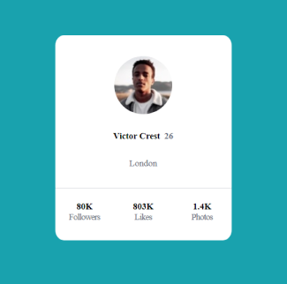
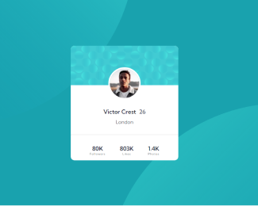

# Projeto design de perfil

O projeto é um exercício que tem como objetivo fazer um layout de perfil.

## Tecnoliga utilizadas

- HTML
- CSS

## Atualizações
- Coloquei cada imagem em seu lugar e organizei os códigos do HTML e CSS. 

## Fotos de antes para a atual

- V1

- V2

## FeedBack

- Este projeto não foi fácil no inicio, mas hoje eu consigo fazer e completar ele sem problema nenhum, porém eu ainda bati um pouco a cabeça no posicionamento das imagens.
- Espero que vocês deixem um feedback para que eu possa aprimorar meu conhecimento.